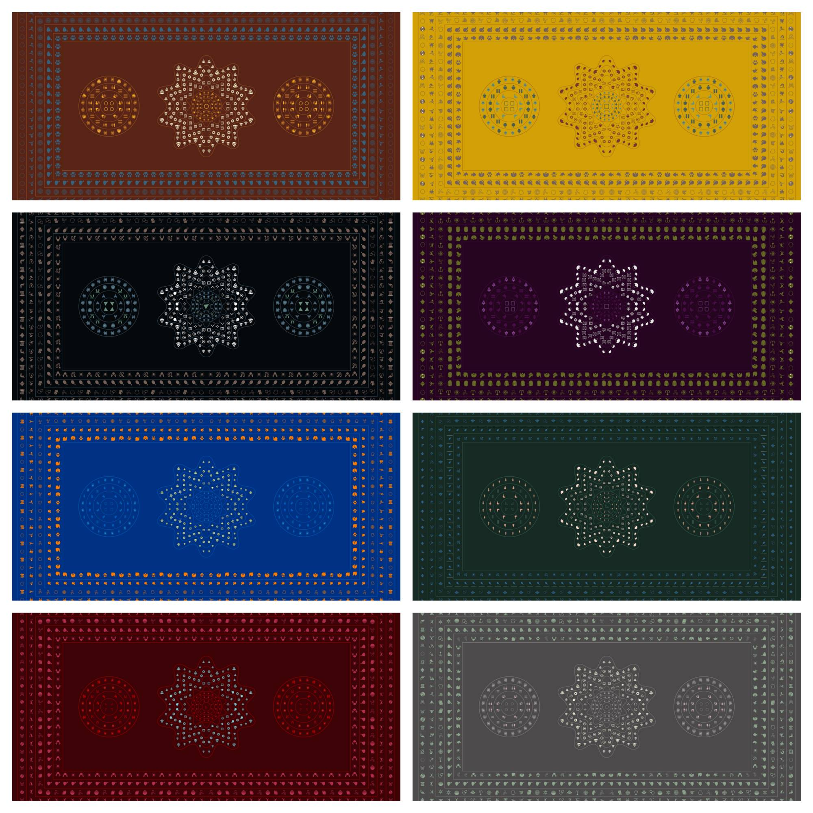
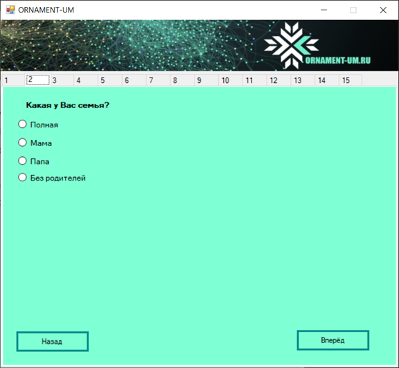
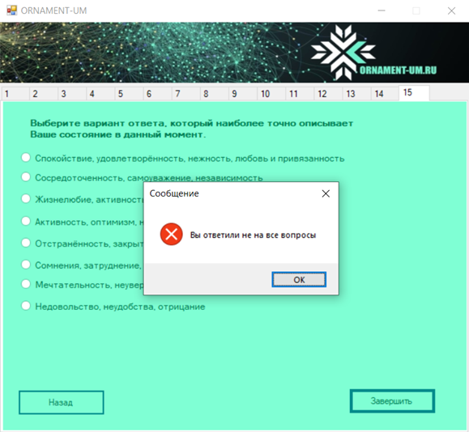
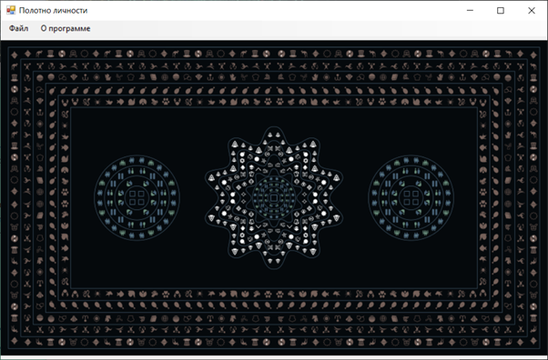
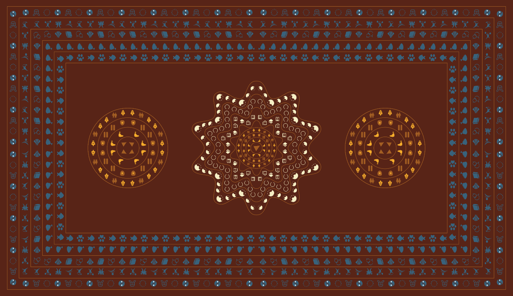

# Application for visualizing user responses

## Идея

Идея заключается в генерации изображения ("Полотна личности") по результатам ответов пользователя на тест. Приложение состоит из теста, который включает в себя 15 вопросов. Каждому варианту ответа на каждый вопрос поставлена в соответствие определённая пиктограмма, которая впоследствии будет расположена на итоговом изображени. Окраска полотна зависит от ответа пользователя на последний вопрос теста.

## Среда разработки и язык программирования
- Visual Studio
- Windows Forms
- C#

## Описание работы программы

Программа состоит из двух форм. В первой форме Form1 расположен контейнер типа TabControl, содержащий в себе 15 вкладок типа TabPage. Каждая вкладка вмещает в себя один вопрос, элемент типа Lable, и несколько вариантов ответа, элементы типа CheckBox или RadioButton (в зависимости от типа вопроса) (рисунок 20). На последней вкладке теста расположена кнопка завершения Button, при нажатии на которую вызывается обработчик события FinishBtn_Click. 

 
 
В методе FinishBtn_Click вызываются методы IsValidation() и PathInitialization(). Первый из них проверяет ответил ли пользователь на все вопросы теста (рисунок 21) и, если ответил, то во втором методе на основе ответов пользователя инициализируется массив строк, содержащий пути к пиктограммам (каждому ответу теста соответствует своя пиктограмма). После чего в методе FinishBtn_Click вызывается метод CanvasGeneration(), содержащийся в классе Canvas, в который передаётся массив путей к пиктограммам и отдельно строка, содержащая путь к фоновому изображению. 
 
 

Далее сгенерированная картинка передаётся в конструктор второй формы Form2. Вторая форма загружает полученное изображение в элемент PictureBox, для того чтобы пользователь мог просмотреть созданную картинку (рисунок 22). Во второй форме также добавлена кнопка сохранения, для того чтобы пользователь мог загрузить изображение на свой компьютер.
 
 

## Пример работы приложения

Пусть в тест были внесены следующие ответы:
1)	Поколение Z- зуммеры (2000 -2011)
2)	Город
3)	Мама
4)	Никого
5)	Нет
6)	Никого
7)	Да, Школа, ВУЗ
8)	Нет работы
9)	Нет
10)	Млекопитающие, рыбы
11)	Традиционное
12)	Книги, моделизм, изучение языков
13)	Зимний, боевые искусства, тяжелая атлетика, спортивные игры
14)	Европа, Россия, Азия
15)	Сомнения, затруднение, волнение 

Для указанных входных данных программа сформировала следующее изображение:

